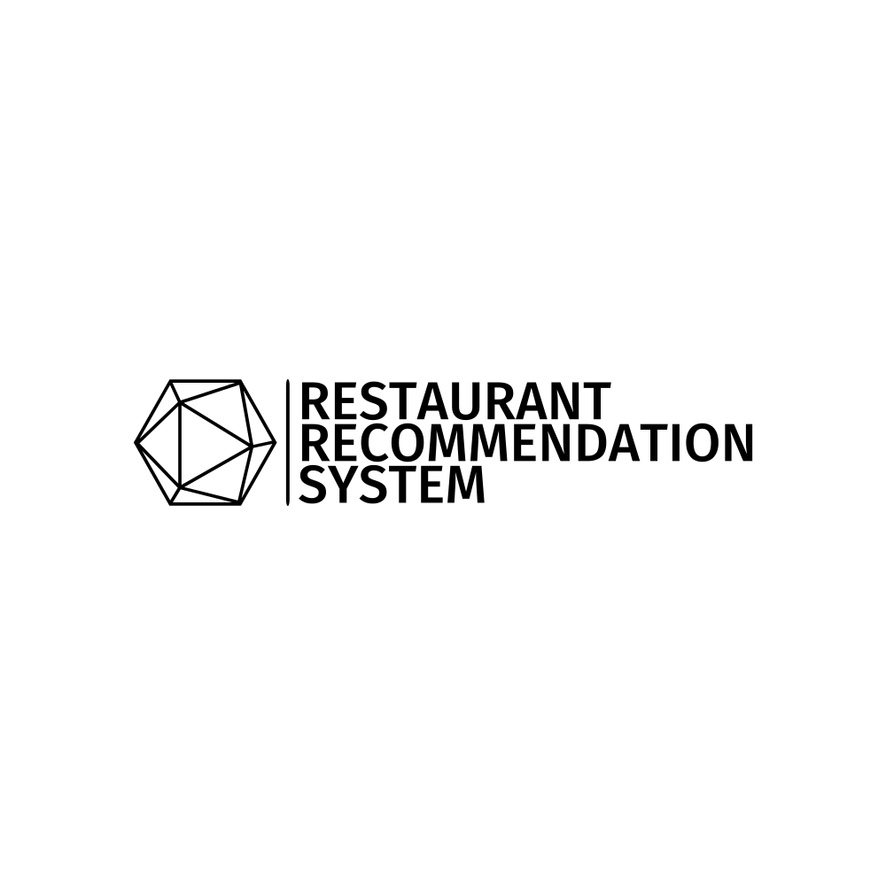

# Restaurant Recommendation System

## Overview
The Restaurant Recommendation System leverages Yelp's extensive data to provide personalized restaurant recommendations. Utilizing various filtering methods and a hybrid approach, the system aims to enhance user engagement with Yelp by offering accurate recommendations.

- **Overview**: The central hub representing the entire system.
- **Location-Based Recommendations**: Utilizes K-means clustering to offer top-rated restaurants near the user's location.
- **Collaborative Filtering**: Analyzes user preferences to provide recommendations.
- **Content-Based Filtering**: Considers restaurant categories and keywords for personalized suggestions.
- **Hybrid Approach**: Combines various methods for a robust recommendation system.

[You can view this diagram in a new tab.](https://showme.redstarplugin.com/d/p1FLYIEE)

[You can edit this diagram online if you want to make any changes.](https://showme.redstarplugin.com/s/pNE1V3fR)

## Authors
- Vaidehi Parikh (parikh.v@northeastern.edu)
- Shaival Shah (shah.shaivals@northeastern.edu)

## Features
- **Location-Based Recommendations**: Utilizes K-means clustering to offer top-rated restaurants near the user's location.
- **Collaborative Filtering**: Analyzes user preferences to provide recommendations.
- **Content-Based Filtering**: Considers restaurant categories and keywords for personalized suggestions.
- **Hybrid Approach**: Combines various methods for a robust recommendation system.

## Data Sources
- **Business Data**: Information on 209K local businesses.
- **Reviews**: 8 million reviews with detailed attributes.
- **User Profiles**: Comprehensive user details.
- **Check-ins**: Data on user check-ins.

## Methodology
1. **Preprocessing**: Clustering based on location, normalization of ratings, sentiment analysis, and matrix factorization.
2. **Modeling**: Implementation of collaborative and content-based filtering, along with a hybrid approach.
3. **Evaluation**: Precision@k metrics for different recommendation methods.

## Results
- Achieved high precision in recommendations.
- The hybrid approach outperformed traditional methods.
- Successfully handled the cold start issue with location-based recommendations.

## Future Work
- Optimize traveling routes using Graph Theory.
- Predict ratings for recommended restaurants.
- Explore Deep Learning and Neural Networks for collaborative filtering.
- Enhance sentiment analysis with Bi-Grams, Tri-Grams, and BERT.
- Deploy the system on a website with a user-friendly interface.

## Conclusion
The Restaurant Recommendation System offers a sophisticated solution to restaurant recommendations using Yelp's data. With its innovative approach and promising results, it holds potential for further exploration and real-world application.
